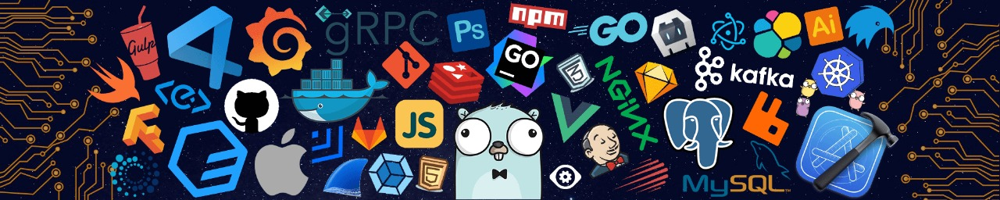

<h1 align="center">Hi there 👋, I'm Ananya!</h1>

<h2 align="center">A passionate Frontend and AI/ML Developer</h2>

  

  Thrilled to connect with you here! As a developer, I specialize in crafting scalable, secure, and intelligent applications. 
  With expertise in web development and AI/ML integration, I aim to solve real-world problems and deliver impactful solutions. 
  Eager to learn and grow, I actively seek new opportunities to enhance my skills and contribute to innovative projects.

---

  

<ul>
  <li>🚀 I’m currently working on building robust AI-driven applications.</li>
  <li>🌱 I’m currently learning Computer Vision.</li>
  <li>💡 Ask me about anything related to MERN and DSA.</li>
  <li>📫 How to reach me: <a href="mailto:ananyachauhan647@gmail.com">ananyachauhan647@gmail.com</a></li>
  <li>📄 Know about my experiences: <a href="https://drive.google.com/file/d/1KdqYZFavNjmOS_Mq2kGIa5aANP8-ZYLf/view?usp=sharing" target="_blank">Resume</a></li>
  <li>🌐 Portfolio: <a href="https://my-portfolio-mu-seven-78.vercel.app/" target="_blank">My Portfolio</a></li>
</ul>

---

<h2 align="center">⚡️ Where to find me</h2>

  
  
  

---

<h2 align="center">💻 Tech Stack ⚡</h2>

  
  
  
  
  
  
  
  
  
  
  
  
  
  
  
  
  
  
  
  
  
  
  
  
  
  
  
  
  
  
  

---

<h2 align="center">📊 GitHub Stats</h2>

  
  
  

---

<h2 align="center">Thank you for Visiting!</h2>

Feel free to explore my repositories and reach out to me for collaborations or discussions. 😊

